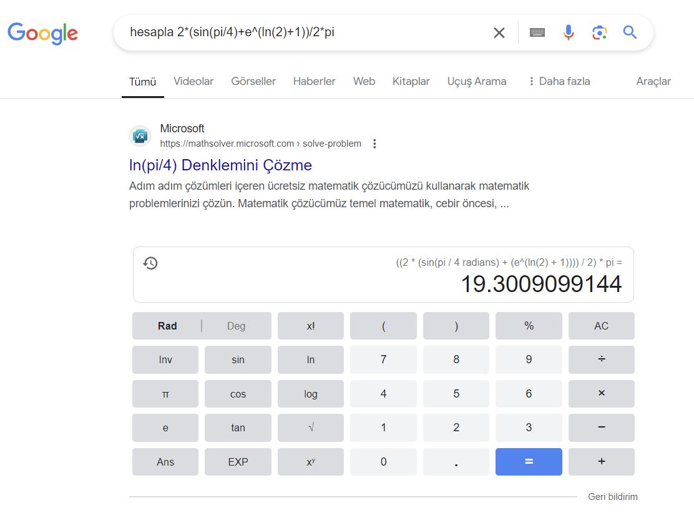
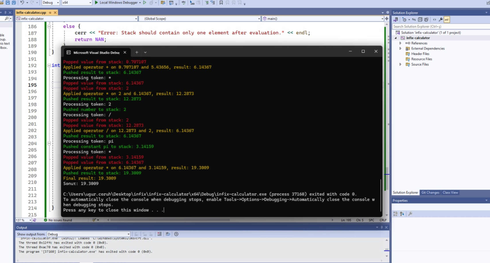
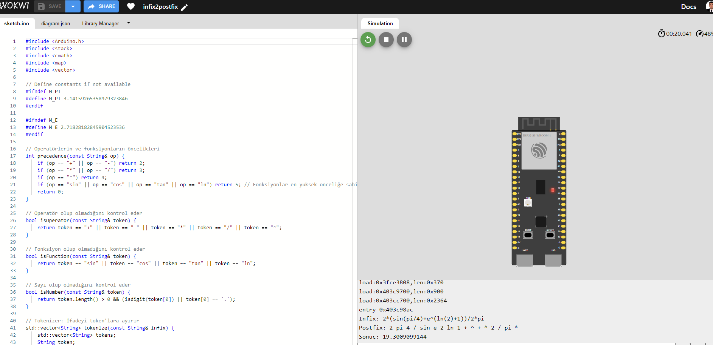

# infix2postfix-complex-calculations

Calculate Infix2Postfix Notations and Results Step-by-Step

```cpp
2*(sin(pi/4)+e^(ln(2)+1))/2*pi
```

## Google Calculator

[hesapla 2*(sin(pi/4)+e^(ln(2)+1))/2*pi - Google'da Ara](https://www.google.com/search?q=hesapla+2*%28sin%28pi%2F4%29%2Be%5E%28ln%282%29%2B1%29%29%2F2*pi&sca_esv=f6a0e070fa17b360&sxsrf=ADLYWILLtwIKWNKPY9-a4K9DRvF9z2xLTQ%3A1728311735751&ei=t_EDZ9W5Lb6Wxc8PgJbq6QI&ved=0ahUKEwiV8cf4vvyIAxU-S_EDHQCLOi0Q4dUDCA8&uact=5&oq=hesapla+2*%28sin%28pi%2F4%29%2Be%5E%28ln%282%29%2B1%29%29%2F2*pi&gs_lp=Egxnd3Mtd2l6LXNlcnAiJmhlc2FwbGEgMiooc2luKHBpLzQpK2VeKGxuKDIpKzEpKS8yKnBpSLwGUABY4QVwAHgBkAEAmAGkAqABtwiqAQUwLjUuMbgBA8gBAPgBAZgCAKACAJgDAJIHAKAHuAQ&sclient=gws-wiz-serp)



## Windows



## Wokwi ESP32-S3

[infix2postfix - Wokwi ESP32, STM32, Arduino Simulator](https://wokwi.com/projects/411097412978595841)



---
